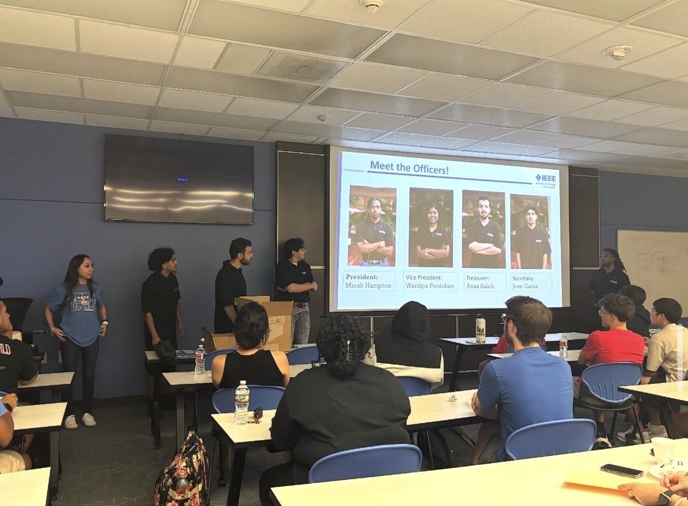

# Lamar University IEEE Student Branch Website

## Secretary Handoff and Maintenance Guide

**Audience:** The student branch secretary or any future website maintainer with little or no web-development experience  
**Repository:** <https://github.com/lamarieee-cmd/Lamar-IEEE-Website>  
**Live website:** <https://lamarieee-cmd.github.io/Lamar-IEEE-Website/>  
**Production branch:** `main`  
**Reviewed against:** commit `a464948` (`remove NA from Upcoming events card`)  
**Guide version:** 1.0, August 19, 2026

> **What this guide is for:** You should be able to read this guide from top to bottom, understand how the website is assembled, make routine updates in Visual Studio Code, publish them through GitHub, confirm the automatic GitHub Pages deployment, and recover from common mistakes.

---

## Contents

1. [Start here](#1-start-here)
2. [The website in plain English](#2-the-website-in-plain-english)
3. [Access and ownership before the handoff](#3-access-and-ownership-before-the-handoff)
4. [First-time computer setup](#4-first-time-computer-setup)
5. [How to work in Visual Studio Code](#5-how-to-work-in-visual-studio-code)
6. [The small amount of HTML, CSS, and JavaScript you need](#6-the-small-amount-of-html-css-and-javascript-you-need)
7. [Git and GitHub without the jargon](#7-git-and-github-without-the-jargon)
8. [The normal edit-to-publish workflow](#8-the-normal-edit-to-publish-workflow)
9. [Repository and file structure](#9-repository-and-file-structure)
10. [How the image files are named](#10-how-the-image-files-are-named)
11. [How to maintain each part of the site](#11-how-to-maintain-each-part-of-the-site)
12. [How GitHub Pages deployment works](#12-how-github-pages-deployment-works)
13. [Testing and publishing checklist](#13-testing-and-publishing-checklist)
14. [Troubleshooting and recovery](#14-troubleshooting-and-recovery)
15. [Current issues found during the handoff review](#15-current-issues-found-during-the-handoff-review)
16. [Suggested maintenance schedule](#16-suggested-maintenance-schedule)
17. [End-of-year turnover checklist](#17-end-of-year-turnover-checklist)
18. [Command and terminology cheat sheets](#18-command-and-terminology-cheat-sheets)
19. [Official help links](#19-official-help-links)

---

# 1. Start here

## Your job as website maintainer

The secretary's main website responsibilities are content upkeep, not advanced programming. In a normal semester, the work will be:

- Keeping the home page's upcoming events, news, and announcements current.
- Adding event photos and descriptions after activities.
- Updating officer names, photographs, years, and contact information.
- Checking membership, Discord, social-media, email, and QR-code links.
- Updating projects when a team has something new to show.
- Publishing changes through GitHub and checking the live site afterward.
- Preserving older events and officer records instead of erasing the branch's history.

## The safest rule

> **Pull first, edit second, preview third, commit fourth, push last. Then check the GitHub Pages deployment and the live website.**

## The five-minute routine

For a simple text update:

1. Open the entire `Lamar-IEEE-Website` folder in VS Code.
2. Confirm the branch shown in the lower-left corner is `main`.
3. Pull the newest copy from GitHub.
4. Open the correct HTML file and make the smallest necessary edit.
5. Save with `Ctrl+S`.
6. Preview the page in a browser and click the edited links.
7. Open Source Control with `Ctrl+Shift+G` and review the changed lines.
8. Stage the correct file, write a clear commit message, and commit.
9. Push or use **Sync Changes**.
10. Open GitHub's **Actions** tab, refresh the browser page after a minute or two, and wait for the Pages deployment to turn green.
11. Open the live site. Allow a few minutes, refresh the page, and use `Ctrl+F5` if the old version is cached.

## Three things that prevent most problems

1. **Capitalization must match.** GitHub Pages treats `Officers.html` and `officers.html` as different files, even if Windows appears to treat them as the same.
2. **Do not rename a file without updating every link to it.** An image name in the folder and its `src="..."` value must match exactly, including the extension.
3. **Only a push to `main` publishes production.** A saved file, local commit, or unmerged branch is not yet on the live site.

---

# 2. The website in plain English

This is a **static website**. It uses:

- HTML files for page content and structure.
- One shared CSS file, `style.css`, for colors, spacing, cards, grids, responsive layouts, and animations.
- Small JavaScript blocks inside `index.html` and the two academic-year event pages for slideshows and photo lightboxes.
- Image files stored in `websiteimages/`.
- GitHub for version history and collaboration.
- GitHub Pages for free public hosting.

It does **not** currently use:

- A database.
- A content-management system such as WordPress.
- A Node/npm build command.
- React, Vue, or another framework.
- A private server or backend.
- A contact form that submits data.

That simplicity is helpful. A browser can display the checked-in files directly, and there are no packages to install just to run the site.

## The publishing flow

```text
Edit files in VS Code
        ↓
Save and preview locally
        ↓
Stage and commit with Git
        ↓
Push the commit to GitHub's main branch
        ↓
GitHub Pages automatically builds and deploys
        ↓
Refresh and verify the live website
```

## Important public-data warning

The repository and Pages site are public. Do not place passwords, access tokens, private student records, unpublished phone numbers, private meeting documents, or anything requiring restricted access in the repository. Deleting a secret in a later commit does not reliably remove it from Git history. If a secret is ever committed, tell the repository owner immediately and rotate the secret.

---

# 3. Access and ownership before the handoff

Public visibility lets someone read the repository, but it does not let them push changes. Before the secretary begins, the repository owner should:

1. Ask the secretary to create or use their own GitHub account.
2. Add that account as a repository collaborator with permission to write.
3. Keep at least one experienced former officer or faculty adviser with administrator access.
4. Confirm the secretary can open the repository and see the **Settings** or appropriate collaboration controls for their role.
5. Confirm that pushes to `main` are allowed under the current branch rules.
6. Confirm the live site URL and save it in the branch's turnover records.

Never share the previous maintainer's GitHub password or personal access token. Each maintainer should use their own account so the commit history shows who made each change.

## Useful access test

Before the official handoff, have the secretary make a harmless branch or spelling update, commit it, push it, and confirm it appears on GitHub. If using a test branch, delete it through GitHub after the exercise. Do not test production access for the first time during an urgent event update.

---

# 4. First-time computer setup

## Install the required tools

Install these on the secretary's computer:

1. **Git** from <https://git-scm.com/downloads>.
2. **Visual Studio Code** from <https://code.visualstudio.com/>.
3. A modern browser such as Chrome, Edge, or Firefox.

Optional but convenient:

- A VS Code local-preview extension such as **Live Server** or **Live Preview**.
- GitHub Desktop, if the secretary strongly prefers a separate Git interface. This guide uses VS Code because the code is already being edited there.

## Configure Git identity once

Open the VS Code terminal with **Terminal > New Terminal** and run:

```bash
git config --global user.name "Your Name"
git config --global user.email "your-github-email@example.com"
```

Use an email associated with the secretary's GitHub account. Git uses this information to label commits; it is not a website contact setting.

## Clone the repository in VS Code

Cloning means downloading a working copy and connecting it to GitHub.

1. Open VS Code.
2. Press `Ctrl+Shift+P` to open the Command Palette.
3. Enter `Git: Clone` and choose **Git: Clone**.
4. Paste:

   ```text
   https://github.com/lamarieee-cmd/Lamar-IEEE-Website.git
   ```

5. Choose a normal work location, such as a folder under Documents. Do not put the project inside another unrelated Git repository.
6. When VS Code asks, choose **Open**.
7. If asked whether you trust the authors, verify the repository name and choose the appropriate trust option.
8. Sign in to GitHub when prompted.

## Terminal alternative

```bash
git clone https://github.com/lamarieee-cmd/Lamar-IEEE-Website.git
cd Lamar-IEEE-Website
code .
```

The final dot in `code .` means "open this entire folder." Opening the folder is important; if you open only `index.html`, VS Code may not show the repository's Source Control tools correctly.

## Confirm the clone

In VS Code:

- The Explorer should show `index.html`, `style.css`, the other HTML pages, and `websiteimages`.
- The lower-left branch indicator should say `main`.
- Source Control (`Ctrl+Shift+G`) should initially say there are no changes.
- The terminal command `git remote -v` should show the GitHub repository as `origin`.

---

# 5. How to work in Visual Studio Code

## The areas you will use most

- **Explorer** (`Ctrl+Shift+E`): opens and organizes files.
- **Search** (`Ctrl+Shift+F`): finds a name or phrase across every page.
- **Source Control** (`Ctrl+Shift+G`): reviews, stages, commits, pulls, and pushes changes.
- **Terminal** (`` Ctrl+` ``): runs Git or a local preview server.
- **Status bar**: shows the current Git branch and synchronization state.

## Open files safely

Click a file once to preview it or double-click to keep its tab open. Make a small change and save it with `Ctrl+S`. A dot on the tab means the file has unsaved changes.

## Search is your friend

Because the header navigation is repeated in many HTML files, use `Ctrl+Shift+F` before changing a repeated item. Examples:

- Search `Abigail Montemayor` to find every place a name may need updating.
- Search `Officers.html` before renaming that file.
- Search `websiteimages/robotics5` to find an image reference.
- Search `Upcoming Events` to jump to the home-page card.

Do not use **Replace All** until you have reviewed every match. A replacement that is correct in one context can be wrong in another.

## Preview locally

### Easiest method: preview extension

If Live Server or Live Preview is installed:

1. Right-click `index.html`.
2. Choose the extension's preview command.
3. Keep the preview open while editing.
4. Navigate through the site and test the changed page.

### No-extension method

Open `index.html` directly in the browser. Most of this project's relative links, images, and JavaScript work when opened as a file.

### Local server method

If Python is installed, run this from the project folder:

```bash
py -m http.server 8000
```

Then open <http://localhost:8000/>. Stop the server with `Ctrl+C` in the terminal.

## Review a changed file

Open Source Control. Click a changed filename to view a diff:

- Red lines are removals.
- Green lines are additions.
- Make sure unrelated names, links, or photographs were not changed accidentally.

This diff review is the best time to catch an accidental deletion before it becomes a commit.

---

# 6. The small amount of HTML, CSS, and JavaScript you need

## HTML: the page and its content

HTML uses opening and closing tags:

```html
<section class="contact-card">
  <h2>General Contact Information</h2>
  <p><strong>Email:</strong> ieee@lamar.edu</p>
</section>
```

The closing tag includes `/`, such as `</section>`. Most layout problems caused while editing HTML come from deleting a closing tag or placing it in the wrong location.

Common tags in this project:

- `<head>` contains page metadata, title, and the stylesheet link.
- `<body>` contains everything visible on the page.
- `<header>` contains the logo and site navigation.
- `<nav>` groups navigation links.
- `<main>` contains the page's primary content.
- `<section>` and `<div>` group related content for layout and styling.
- `<h1>`, `<h2>`, and `<h3>` are headings.
- `<p>` is a paragraph.
- `<ul>` is a bullet list and `<li>` is one list item.
- `<a href="...">` is a link.
- `` displays an image.
- `<script>` contains JavaScript.
- `<!-- comment -->` leaves a note that is not displayed on the page.

## Attributes

Attributes provide details inside an opening tag:

```html

```

- `src` is the exact image path.
- `alt` describes the image for accessibility and when the image cannot load.
- `class` connects the element to CSS rules.
- `href` is the destination of a link.

Keep the quotation marks. Do not paste a Windows path such as `C:\Users\...` into HTML; the website needs a relative repository path such as `websiteimages/gbm1.jpg`.

## CSS: how the site looks

`style.css` contains selectors and properties:

```css
.event-card {
  background: rgba(255, 255, 255, 0.96);
  padding: 28px;
  border-radius: 18px;
}
```

`.event-card` applies to HTML elements containing `class="event-card"`. Each property normally ends with a semicolon. A missing `}` can affect every rule that follows it.

The bottom parts beginning with `@media (max-width: 850px)` are mobile rules. When changing a layout, test both a wide desktop window and a narrow phone-sized window.

## JavaScript: the interactive behavior

The JavaScript is small and already written.

### Home page

The script near the bottom of `index.html`:

- Keeps track of `slideIndex`.
- Shows one `.slides` element at a time.
- Moves when the left or right button calls `changeSlide(...)`.
- Advances automatically every `4000` milliseconds, or four seconds.

Adding another correctly structured `.slides` block automatically includes it in the rotation.

### Event-year pages

The script near the bottom of each academic-year event page:

- Finds the slideshow whose button was clicked.
- Removes the `active` class from its current image.
- Adds `active` to the next or previous image.
- Opens a full-screen lightbox when an image is clicked.
- Closes the lightbox when the overlay is clicked.

Only the first `.event-slide` in each event should begin with `active`.

### `script.js`

The separate `script.js` file currently contains only a small demonstration function and is not linked by any HTML page. Editing it will not change the current home or event slideshows. The active slideshow code is inline inside the HTML files.

---

# 7. Git and GitHub without the jargon

## The important concepts

| Term | Meaning in this project |
|---|---|
| Repository | The project folder plus its version history. |
| Local | The copy on the secretary's computer. |
| Remote | The GitHub copy. Its normal nickname is `origin`. |
| Branch | A line of work. `main` is the production branch. |
| Working changes | Saved edits that have not been committed. |
| Stage | Select the exact changes to include in the next commit. |
| Commit | A labeled snapshot in local Git history. |
| Push | Upload local commits to GitHub. |
| Fetch | Download information about remote commits without merging them into local work. |
| Pull | Fetch and then integrate remote changes into the current branch. |
| Merge | Combine two lines of history. |
| Sync Changes | VS Code convenience action that pulls and pushes. |
| Pull request | A GitHub review page used to merge a branch into `main`. |

## Fetch, pull, and push

These are related but different:

- **Fetch** asks, "What changed on GitHub?" It updates your knowledge without changing the files you are editing.
- **Pull** asks, "Bring GitHub's changes into my current branch." Pull before editing so you do not work from an old copy.
- **Push** says, "Upload my committed work to GitHub." For this project, a push to `main` starts deployment.

## Commit messages

Write a short statement describing the result:

Good examples:

- `Update September GBM date and room`
- `Add Arduino workshop photos`
- `Add 2026-2027 officer board`
- `Fix membership QR image path`

Avoid messages such as `update`, `stuff`, `changes`, or `final final`. A good history makes recovery easier.

## Direct-to-main versus branch-and-review

### Direct-to-main workflow

This is the shortest workflow and may be reasonable for one-person, low-risk updates such as correcting a date. A push immediately triggers production deployment.

### Branch-and-review workflow

Use a branch for large event additions, navigation changes, page redesigns, or when another officer can review:

```bash
git switch main
git pull origin main
git switch -c update-2026-09-gbm
```

Make, test, stage, and commit the changes, then:

```bash
git push -u origin update-2026-09-gbm
```

Open the repository on GitHub, create a pull request, review the file changes, and merge it into `main`. The site deploys after the merge reaches `main`, not merely when the branch is pushed.

---

# 8. The normal edit-to-publish workflow

Follow this sequence every time, even when the change seems small.

## Step 1: Open the correct folder and branch

Open the entire cloned folder in VS Code. Confirm `main` in the lower-left corner or run:

```bash
git branch --show-current
```

## Step 2: Make sure there is no unfinished work

```bash
git status
```

If files are already modified and you do not know why, stop and investigate. They may be someone else's unfinished changes on that computer.

## Step 3: Pull before editing

In VS Code, open Source Control, choose the `...` menu, and choose **Pull**. Terminal equivalent:

```bash
git pull origin main
```

## Step 4: Make one focused update

Open the relevant file. Save frequently. For an update that includes a photograph, add the image to `websiteimages/` and update the HTML in the same work session.

## Step 5: Preview and test locally

At minimum:

- Open the edited page.
- Confirm every new image displays.
- Click every new or edited link.
- Test slideshow arrows if affected.
- Click event photos to test the lightbox if affected.
- Narrow the browser window to check mobile layout.
- Proofread names, dates, room numbers, and email addresses against the original source.

## Step 6: Review the diff

Open Source Control and click each changed file. Verify that only intended lines changed. Pay special attention to closing tags around copied event or officer cards.

## Step 7: Stage the related files

Click the `+` beside each intended file. Terminal example:

```bash
git add index.html websiteimages/new-photo.jpg
```

Avoid `git add .` until you are comfortable reviewing everything it would include. It can accidentally stage `desktop.ini`, editor settings, or unrelated files.

## Step 8: Commit

Enter a clear message in Source Control and choose **Commit**, or run:

```bash
git commit -m "Update September GBM details"
```

## Step 9: Pull or sync once more if others may be editing

If the repository changed while you worked, pull and resolve any conflict before pushing. VS Code's **Sync Changes** performs pull and push together, but beginners may find separate **Pull** and **Push** actions easier to understand.

## Step 10: Push

```bash
git push origin main
```

If you are working on a review branch, push that branch and merge its pull request instead.

## Step 11: Confirm deployment

1. Open the repository on GitHub.
2. Confirm your commit appears on `main`.
3. Open **Actions**.
4. Look for the newest `pages-build-deployment` run.
5. The GitHub browser page may not update automatically. Wait a minute or two and refresh it.
6. Wait for the build and deploy jobs to show a green check.
7. Open the live site.
8. GitHub Pages can take several minutes to display the update. Refresh the live page after a few minutes.
9. If necessary, use a hard refresh: `Ctrl+F5` or `Ctrl+Shift+R`.
10. Navigate to the exact changed page and verify production, not just the home page.

---

# 9. Repository and file structure

All publishable files are currently stored at the repository root except images, which are in `websiteimages/`.

```text
Lamar-IEEE-Website/
├── index.html                 Home page
├── Membership.html            Membership page
├── projects.html              Projects page
├── events.html                Academic-year event hub
├── 2025-2026 Events.html      Event archive for 2025-2026
├── 2024-2025 Events.html      Event archive for 2024-2025
├── Officers.html              Officer-position hub
├── presidents.html            President history
├── Vice-Presidents.html       Vice-president history
├── Treasurers.html            Treasurer history
├── Secretaries.html           Secretary history
├── chairs.html                Chair histories grouped by role
├── contact.html               Contact and social information
├── style.css                  Shared visual styling
├── script.js                  Unused demo script at present
└── websiteimages/             Logos, QR codes, slides, event photos,
                              project photos, and officer portraits
```

## Shared page pattern

Most pages have:

1. A `<!DOCTYPE html>` declaration.
2. A `<head>` with character encoding, mobile viewport, page title, and `style.css` link.
3. A repeated `<header>` containing the IEEE logo, site name, and navigation.
4. A page-specific `<main>` or section.
5. Optional inline JavaScript near the bottom.
6. Closing `</body>` and `</html>` tags.

There is no template system. If the main navigation changes, the same link normally needs to be updated in every HTML page. Use VS Code's global search and review every replacement.

## Page names and capitalization

The current repository mixes uppercase and lowercase filenames. Examples include `Membership.html`, `Officers.html`, `Vice-Presidents.html`, and lowercase `events.html`.

For existing files, copy the name exactly. For new files, use lowercase, hyphens, and no spaces, for example:

```text
2026-2027-events.html
```

Do not casually rename all existing pages during a routine update. Renaming requires updating every reference and testing every navigation path.

---

# 10. How the image files are named

The current naming system uses a subject or role prefix followed by a sequence number.

## Home-page slideshow

Files named `slide...` are used by the large home-page slideshow:

```text
slide1a.jpg
slide1.png
slide2.jpeg
slide3.jpg
slide4.JPG
...
slide9.jpg
```

The extensions and capitalization are not consistent, so the HTML reference must match exactly. For example, `slide4.JPG` is different from `slide4.jpg` on GitHub Pages.

## Event photographs

Event photos use a short event keyword or abbreviation plus a number:

- `gbm1.jpg` through `gbm5.jpg`: general body meeting.
- `pcb1.jpg` through `pcb3.jpg`: PCB workshop.
- `gearup1.jpg` through `gearup3.jpg`: Gear Up Games.
- `mahjong1.jpg` and `mahjong2.jpg`: Mahjong Night.
- `arduino1.jpg` and `arduino2.jpg`: Arduino workshop.
- `robotics1.jpg` through `robotics6.jpg`: Region 5 robotics/conference.
- `dc1.jpg` and `dc2.jpg`: digital-circuits workshop.
- `westbrook1.jpg` through `westbrook5.jpg`: Westbrook outreach.
- `st1.jpg` through `st5.jpg`: older softball tournament.
- `DE1.jpg` through `DE4.jpg`: Discover Engineering.

Some current sets use capitals (`Softball1.jpg`, `DE1.jpg`, `KiCad1.jpg`) while others do not. This is a common source of production-only errors.

## Officer photographs

Officer portraits generally use the role followed by a number:

- `president1.jpeg` through `president5.png`.
- `vp1.jpg` and `vp2.jpg`.
- `treasurer1.jpg` through `treasurer4.jpg`.
- `secretary1.jpg` and `secretary2.jpg`.
- `socialmedia1.jpg` and `socialmedia2.jpg`.
- `project1.jpg` and `program1.jpg`.

The number does not necessarily equal the academic year. Always inspect the matching HTML card before replacing or reusing a portrait.

## Project, logo, and QR images

- `robot1.jpg` through `robot3.jpg`: project gallery.
- `ieee-logo.png`: header logo on every page.
- `national-qr.png`: national IEEE membership QR code.
- `branch-qr.png`: expected by `Membership.html`, but this file is currently missing.

## Recommended naming rule for new images

Keep existing references working, but use a stricter rule for new files:

```text
year-month-subject-01.jpg
```

Examples:

```text
2026-09-gbm-01.jpg
2026-09-gbm-02.jpg
2026-10-site-tour-01.jpg
2026-2027-secretary-abigail-montemayor.jpg
```

Rules:

- Use lowercase letters.
- Use hyphens, not spaces.
- Use a two-digit sequence (`01`, `02`, `03`) so files sort correctly.
- Prefer `.jpg` for ordinary photographs.
- Use `.png` for logos, QR codes, or graphics that need transparency or very sharp flat colors.
- Avoid names such as `IMG_4827.jpg`, `final.jpg`, `newnew.png`, or another person's full local path.

## Image-size guidance

The reviewed repository contains about 85 image files totaling roughly 47.5 MB. `slide2.jpeg` alone is approximately 9.6 MB at 6000 by 4000 pixels. Large images slow mobile loading and make cloning/pushing take longer.

Before adding a photograph:

1. Keep an original copy outside the repository.
2. Crop it appropriately.
3. Resize ordinary website photos to roughly 1600-2000 pixels on the longest side unless a larger file is truly needed.
4. Export as JPEG around 75-85% quality.
5. Aim for under 1 MB per ordinary photo; several hundred KB is usually sufficient.
6. Open the compressed image and confirm faces and text still look good.

Do not overwrite the only original photograph with a compressed copy.

---

# 11. How to maintain each part of the site

## 11.1 Home page: `index.html`

The home page contains four main parts:

1. Shared header/navigation.
2. Ten-image automatic slideshow.
3. Upcoming Events, Latest News, and Announcements cards.
4. Quick Links.

### Update upcoming events

Search for `<h2>Upcoming Events</h2>`. Keep only future or very recent items. A clean structure is:

```html
<div class="home-card featured-card">
  <h2>Upcoming Events</h2>
  <ul class="news-list">
    <li>General Body Meeting: August 27 at 5:30 PM - Cherry 2631</li>
    <li>PCB Workshop: September 10 at 6:00 PM - Engineering Lab</li>
  </ul>
</div>
```

Confirm every detail against the officer-approved announcement. Remove an item after the event has passed, but preserve it on the appropriate academic-year event archive if photos and a recap are available.

### Update latest news

Search for `<h2>Latest News</h2>`. Each item belongs inside its own `<li>...</li>`. Put the newest item first. Keep the section short enough to remain useful.

### Update announcements and the board list

Search for `<h2>Announcements</h2>`. At annual turnover, update the year, titles, names, and line breaks. Then also update officer-history pages and `contact.html`; changing only the home page creates contradictory information.

### Add a home slideshow image

1. Prepare and compress the new image.
2. Put it in `websiteimages/` with a unique lowercase filename.
3. In the `.slideshow` section, copy one complete block:

   ```html
   <div class="slides fade">
     
   </div>
   ```

4. Place it before the two slideshow buttons.
5. Save and test the automatic rotation and both arrows.

No `active` class is needed for the home slideshow; its JavaScript selects the first image automatically.

### Remove a home slideshow image

Remove the entire matching `<div class="slides fade">...</div>` block. Delete the image file only if it is not referenced anywhere else. Use global search on the filename first.

## 11.2 Membership page: `Membership.html`

This page has:

- A local Lamar branch membership card.
- A national IEEE membership card.
- QR-code images.
- Membership buttons.
- A benefits list.

### Update a membership link

Replace only the `href` value:

```html
<a href="https://correct-destination.example" class="membership-btn">
  Join the Lamar IEEE Branch
</a>
```

For an external link that opens a new tab, use:

```html
<a href="https://correct-destination.example"
   target="_blank"
   rel="noopener noreferrer"
   class="membership-btn">
  Join IEEE
</a>
```

The current local button uses `href="#"`, which is only a placeholder and does not go to a membership form.

### Replace a QR code

1. Confirm the QR destination by scanning it yourself.
2. Save the file in `websiteimages/`.
3. If keeping the current HTML unchanged, name the local QR file exactly `branch-qr.png`.
4. Preview the page and scan the displayed QR from both a computer screen and a phone screenshot.
5. Click the accompanying button and make sure it leads to the same intended destination.

## 11.3 Projects page: `projects.html`

The current page presents one project, **Autonomous Robot**, using:

- A project title.
- A Purpose section.
- A three-image gallery (`robot1.jpg`, `robot2.jpg`, and `robot3.jpg`).

### Update the existing project

Edit the text inside the matching `<section class="project-section">`. Replace gallery image references one at a time and keep descriptive `alt` text.

### Add a project

The simplest method is to copy a complete, validated project showcase rather than inserting isolated closing tags. Give the project its own heading, summary/purpose, and gallery. Test the page carefully because the reviewed file already contains mismatched closing tags; see the known-issues section before copying its current structure.

If projects grow beyond a few entries, a future maintainer should redesign this page into a project-card hub with one detail page per project. That is a planned improvement, not required for routine upkeep.

## 11.4 Events hub: `events.html`

This page links to one HTML file per academic year. The newest year should appear first.

### Add a new academic year

1. Copy the most recent year page.
2. Give the new file a safe name such as `2026-2027-events.html`.
3. Update its `<title>` and `<h1>`.
4. Remove the previous year's event cards from the copy, leaving one tested template card if helpful.
5. Add a new year card near the top of `events.html`:

   ```html
   <a href="2026-2027-events.html" class="year-card">
     <h2>2026-2027 Events</h2>
     <p>View events, photos, and branch highlights from the 2026-2027 year.</p>
   </a>
   ```

6. Preview both the hub and new page.
7. Keep older year pages linked as archives.

## 11.5 Academic-year event pages

Current files:

- `2025-2026 Events.html`
- `2024-2025 Events.html`

Events appear in the same order as their event-card sections. Put the newest event at the top of `.events-list`.

### Event-card template

```html
<section class="event-card">
  <div class="event-info">
    <h2>Event Name</h2>
    <p class="event-date">September 10, 2026</p>
    <p>
      A short, proofread description of what happened, who participated,
      and any organization that should be thanked.
    </p>
  </div>

  <div class="event-slideshow">
    <div class="event-slide active">
      
    </div>
    <div class="event-slide">
      
    </div>

    <button class="event-btn prev" onclick="changeEventSlide(this, -1)">&#10094;</button>
    <button class="event-btn next" onclick="changeEventSlide(this, 1)">&#10095;</button>
  </div>
</section>
```

### Rules for a working event slideshow

- Copy the entire event card, not half of it.
- Exactly one image per event starts with `class="event-slide active"`.
- Every later image uses `class="event-slide"` without `active`.
- Each `src` matches a real file exactly.
- Buttons remain inside that event's `.event-slideshow`.
- Images keep `onclick="openLightbox(this.src)"` if they should enlarge.
- Alt text describes the real scene, not only `photo 1`.
- The shared lightbox and script remain once near the bottom of the page, not once per event.

### Add an event with one image

Use one `.event-slide active` block. The existing next/previous buttons will loop to the same photo. You may leave them for structural consistency or hide/remove them for that card with a carefully tested enhancement.

### Archive instead of delete

An event can disappear from the home page after it passes but should normally remain on the year's event archive. This preserves institutional history for recruitment, reports, funding, and future officers.

## 11.6 Officers hub: `Officers.html`

This is a menu of role cards linking to Presidents, Vice Presidents, Treasurers, Secretaries, and Chairs. If a new officer category is created, add a role card here and create a matching detail page. Also decide whether it belongs in the home-page board announcement.

## 11.7 Officer-history pages

Files:

- `presidents.html`
- `Vice-Presidents.html`
- `Treasurers.html`
- `Secretaries.html`

Each uses an `.officer-grid` containing `.officer-card` elements. Put the newest officer first while keeping previous records.

### Officer-card template

```html
<div class="officer-card">
  
  <h3>Officer Name</h3>
  <p class="officer-year">2026-2027</p>
  <p class="officer-message">
    "A short approved message from the officer."
  </p>
</div>
```

Before publishing an officer portrait or quote, confirm the student has approved the exact photo and wording.

### Annual officer update locations

When a new board begins, check all of these:

- `index.html` announcement.
- The correct role-history page.
- `chairs.html` for chair positions.
- `contact.html` for current public contacts.
- Home/latest news if the election is being announced.
- Image files and alt text.

## 11.8 Chairs page: `chairs.html`

Chair records are grouped into sections such as Social Media, Projects, Robotics, and Programs. Add a new officer inside the matching group's `.officer-grid`. Do not create an `.officer-grid` inside another `.officer-grid`; keep sibling cards inside one grid container.

If a new chair category is created, copy one entire `<section class="chair-group">...</section>`, update its heading and cards, and also update the description on the Chairs role card in `Officers.html`.

## 11.9 Contact page: `contact.html`

The contact page has four cards:

- General contact information.
- Current officer contacts.
- Social/community channels.
- A membership prompt.

### Make email addresses clickable

```html
<p>
  <strong>President:</strong>
  Anas Saleh - <a href="mailto:asaleh@lamar.edu">asaleh@lamar.edu</a>
</p>
```

### Make Discord or social links clickable

```html
<li>
  Discord:
  <a href="https://discord.gg/example" target="_blank" rel="noopener noreferrer">
    Join the Lamar IEEE Discord
  </a>
</li>
```

Test invite links in a private/incognito browser window when possible. A link that works only for the maintainer's signed-in account may still be unusable for new students.

Only publish officer email addresses that are intended for public contact.

## 11.10 Shared styling: `style.css`

The stylesheet is divided by comments into groups for:

- Home page and header.
- Membership.
- Officer pages.
- Event cards, slideshows, year cards, and lightbox.
- Projects.
- Contact page.
- Responsive/mobile layouts.

### Safe CSS workflow

1. Search for the class used by the HTML element.
2. Change one property at a time.
3. Save and preview every affected page, not only the page you had open.
4. Test at wide and narrow widths.
5. If adding a class, use a descriptive name and place it in the appropriate commented section.

The header and body rules affect nearly every page. Changes to `.header`, `.nav`, `body`, `.page-content`, or shared card classes have broad effects and deserve extra testing.

## 11.11 Navigation

The navigation is copied into every page rather than generated from one template. If a page is added, renamed, or removed:

1. Use global search for the old navigation line.
2. Update every HTML file that contains the header.
3. Match capitalization exactly.
4. Test from the home page and from at least one officer and one event page.
5. Test the logo and back links as well as the main navigation.

---

# 12. How GitHub Pages deployment works

## Current production configuration

The reviewed project is publicly hosted at:

<https://lamarieee-cmd.github.io/Lamar-IEEE-Website/>

The current production content comes from the `main` branch, with the HTML/CSS/image files at the repository root. `index.html` is the landing page.

The repository does not contain a custom workflow file. GitHub provides a generated workflow named `pages-build-deployment`. The reviewed run performed these main jobs:

1. Check out the `main` branch.
2. Build the Pages artifact using GitHub's Pages/Jekyll process.
3. Upload the artifact.
4. Deploy it to the `github-pages` environment.

The site itself is still plain HTML/CSS/JavaScript; the secretary does not need to run a local Jekyll or npm build command.

## What triggers deployment

A commit reaching the configured source on `main` triggers the automatic Pages workflow. These actions alone do not publish production:

- Saving a file in VS Code.
- Staging a file.
- Making a local commit without pushing.
- Fetching or pulling.
- Pushing an unmerged work branch.

## What the secretary should expect

Recent reviewed deployments completed in roughly one minute, but this is not a guarantee. GitHub's interface may continue showing old information until the browser page is refreshed.

After pushing or merging:

1. Open **Actions** in the GitHub repository.
2. Find the newest Pages build/deployment.
3. If it is queued or in progress, wait.
4. Refresh the GitHub browser page after a minute or two to see its latest status.
5. When all jobs are green, open the live site.
6. Allow a few minutes for the public version and caches to update.
7. Refresh the live page. Use `Ctrl+F5` or `Ctrl+Shift+R` if needed.

GitHub's own Pages documentation notes that publishing can take several minutes and sometimes up to about ten minutes. Do not immediately make a second "fix" commit just because the old site is still visible for a minute.

## GitHub Pages is case-sensitive

The production server runs in an environment where case matters:

```text
Officers.html   ≠   officers.html
Membership.html ≠  membership.html
slide4.JPG      ≠   slide4.jpg
```

A link may appear to work during local Windows testing but return 404 in production. Exact-case review is required before every push.

## Relative paths and the project URL

This is a project site under `/Lamar-IEEE-Website/`. The current code correctly uses relative paths such as:

```html
<link rel="stylesheet" href="style.css">

```

Avoid changing these to paths beginning with `/` unless you understand the project-site base path. `/websiteimages/...` would point to the account site's root, not necessarily this repository's folder.

## If deployment fails

1. Open the failed run in **Actions**.
2. Open the red job and the first red step.
3. Read the error message before editing anything else.
4. Confirm the commit is on `main` and includes `index.html` at the expected source location.
5. Fix the smallest root cause, commit, and push again.
6. If the workflow is green but one image is missing, deployment probably succeeded; check the filename, case, extension, and HTML path instead.

Do not change **Settings > Pages** casually. Changing the source branch or folder can take the entire site offline.

---

# 13. Testing and publishing checklist

## Before editing

- [ ] I opened the entire repository folder, not one loose HTML file.
- [ ] I am on the intended branch.
- [ ] `git status` does not show unexplained work.
- [ ] I pulled the newest `main` branch.
- [ ] I know which file and content block should change.

## Before committing

- [ ] Every intended file is saved.
- [ ] The edited page opens locally.
- [ ] New images display and are reasonably compressed.
- [ ] Every new or edited link works.
- [ ] Filename capitalization and extension match exactly.
- [ ] The navigation still works.
- [ ] Slideshows still move in both directions.
- [ ] Each event slideshow has exactly one initial `active` slide.
- [ ] The event lightbox opens and closes.
- [ ] The page works in a narrow browser window.
- [ ] Names, titles, dates, rooms, and emails were proofread.
- [ ] Alt text describes each new image.
- [ ] No private or sensitive information was added.
- [ ] The Source Control diff contains no unrelated edits.

## Before pushing

- [ ] Only related files are staged.
- [ ] The commit message explains the result.
- [ ] I pulled/synced if another person may have edited the repository.
- [ ] Any merge conflict was resolved and retested.

## After pushing

- [ ] The commit appears on GitHub's `main` branch, or its pull request was merged.
- [ ] The newest `pages-build-deployment` run is green.
- [ ] I refreshed the GitHub browser page to see the current status.
- [ ] I allowed several minutes for Pages to update.
- [ ] I refreshed or hard-refreshed the live site.
- [ ] I checked the exact live page, images, links, desktop view, and mobile-width view.

---

# 14. Troubleshooting and recovery

## "I saved the file, but GitHub did not change"

Saving affects only the local copy. Open Source Control, commit the change, and push it.

## "My commit is on GitHub, but the website did not change"

Check:

1. Is the commit on `main`, not only a work branch?
2. Is the newest Pages workflow green?
3. Did you wait several minutes and refresh both GitHub and the live site?
4. Are you viewing the correct live URL and page?
5. Does a hard refresh show the update?

## "The page works locally but gives 404 on GitHub Pages"

The most likely cause is capitalization or a wrong extension. Compare the HTML value and repository filename character by character.

## "A photo is broken"

Check in this order:

1. Is the image actually committed and pushed, not just copied locally?
2. Is it inside `websiteimages/`?
3. Does the HTML use `websiteimages/filename.ext`?
4. Do filename, capitalization, and extension match exactly?
5. Does the browser's image URL return 404?
6. Was the image accidentally renamed by a phone or cloud-sync tool?

## "The event slideshow is blank or behaves strangely"

Confirm:

- The first slide has `event-slide active`.
- Other slides have only `event-slide`.
- There is one `active` slide at startup, not zero or several.
- Buttons remain within that slideshow.
- Closing `</div>` and `</section>` tags were copied correctly.
- The JavaScript block near the bottom still exists once.

## "A CSS edit did nothing"

Confirm:

- The file was saved.
- The HTML class and CSS selector match.
- The rule was not overridden later in `style.css`.
- The browser is not showing cached CSS; hard refresh.
- The edited page actually loads `style.css` from the same folder.

## "VS Code does not show Source Control"

Possible causes:

- Only a file was opened instead of the repository folder.
- Git is not installed or VS Code needs restarting after installation.
- The wrong folder was opened.
- The hidden `.git` folder is missing because the project was downloaded as a ZIP instead of cloned.

## "Push was rejected because the remote contains work I do not have"

Someone pushed first. Do not force-push. Run:

```bash
git fetch origin
git pull origin main
```

Resolve any conflict, retest, commit the resolution if required, and push again.

## Merge conflicts

A conflict means Git cannot safely choose between two edits to the same area.

1. Open Source Control and the conflicted file.
2. Read both versions carefully.
3. Use VS Code's merge editor or edit the final content manually.
4. Remove conflict markers such as `<<<<<<<`, `=======`, and `>>>>>>>` if manually editing.
5. Do not choose "current," "incoming," or "both" based only on the label; understand which content should remain.
6. Save and preview the page.
7. Stage the resolved file and complete the merge commit.
8. Push and verify deployment.

If you need to abandon a pull that created a normal merge and no resolution work should be kept:

```bash
git merge --abort
```

If unsure, stop and ask the previous maintainer before running recovery commands.

## Undo a bad production commit

The preferred shared-history recovery is a revert, which creates a new commit that reverses an earlier one:

```bash
git log --oneline -10
git revert COMMIT_ID
git push origin main
```

Preview if possible and verify the automatic deployment. Do not use `git reset --hard` or force-push on shared production history unless an experienced repository administrator has deliberately chosen that recovery method.

## Recover one file before committing

If Source Control shows an unwanted local edit, VS Code can discard that file's changes. Discard is destructive to unsaved/uncommitted work, so inspect the diff and make sure the target is correct first.

## Authentication problems

Use the secretary's GitHub account. GitHub does not accept the account password as a Git HTTPS password in older terminal prompts; use VS Code/GitHub sign-in or an approved personal access token. Never paste a token into HTML, a commit message, or a shared screenshot.

---

# 15. Current issues found during the handoff review

This guide does not silently change the production repository. The following items were found by comparing every local HTML `href`/`src` reference against the exact Git-tracked filenames and checking the live Pages URLs.

## Priority 1: broken live links or images

| Location | Current reference | Existing target or action |
|---|---|---|
| `index.html` Quick Links | `officers.html` | Change to `Officers.html`. The lowercase URL currently returns 404. |
| `contact.html` membership button | `membership.html` | Change to `Membership.html`. The lowercase URL currently returns 404. |
| `Membership.html` local QR | `websiteimages/branch-qr.png` | Add the approved `branch-qr.png` file or update the HTML to the correct real filename. |
| `2025-2026 Events.html` Region 5 slide | `websiteimages/robotics5.png` | The tracked file is `websiteimages/robotics5.jpg`. |
| `2025-2026 Events.html` volleyball slide | `websiteimages/volleyball.jpg` | The tracked likely matching file is `websiteimages/volleyball3.jpg`. Verify the photo, then correct the reference. |

## Priority 2: HTML structure and slideshow cleanup

- `2024-2025 Events.html` gives `active` to several slides in the same event. Keep `active` only on the first slide of each event.
- Both academic-year event files contain an extra closing `</script>` tag after the valid script block.
- `Membership.html` ends without the normal `</main>`, `</body>`, and `</html>` closing structure.
- `projects.html` contains unmatched extra `</p>` and `</section>` closing tags around the Purpose area.
- `chairs.html` contains nested `.officer-grid` containers and uneven closing structure. Keep one grid with sibling officer cards per chair group.
- The home page's Upcoming Events area places `<li>` elements inside a `<p>`. Use a `<ul>` around list items instead.

Browsers try to recover from malformed HTML, which can make a page appear fine until a later edit exposes the problem. Clean these items before using the affected blocks as future templates.

## Priority 3: consistency and maintenance improvements

- `websiteimages/Softball7.jpg`, `websiteimages/robotics5.jpg`, and `websiteimages/volleyball3.jpg` were not referenced by any HTML page at the reviewed commit. Two appear to correspond to broken references; verify before deleting anything.
- `script.js` is not loaded by the site and may confuse future maintainers. Either document it as unused, remove it in a reviewed cleanup, or move active inline scripts into it as a deliberate refactor.
- `desktop.ini` is tracked in both the repository root and image folder. It is Windows folder metadata, not website content.
- Filename capitalization and extensions are inconsistent. Preserve current links, but use the lowercase/hyphen naming rule for new assets.
- The image folder is about 47.5 MB, and one home slide is about 9.6 MB. Compress large images in a reviewed change to improve mobile loading.
- Several contact/social entries are plain text rather than clickable links.
- Some alt text says only a role or generic photo number. New and updated images should receive meaningful descriptions.
- Copy, dates, role years, and spelling should receive an annual proofread for consistency.

## Safe cleanup approach

Do not combine all cleanup with an urgent content update. Create a separate branch such as `site-maintenance-cleanup`, fix one category at a time, test every page, and use a pull request so another officer can review the diff.

---

# 16. Suggested maintenance schedule

## Weekly during an active semester

- Check the home page for expired upcoming events.
- Verify the next meeting date, time, and room.
- Confirm public contact and invitation links still work.
- Check GitHub for unreviewed branches or failed Pages runs.

## Before an event

- Add or update the home Upcoming Events item.
- Verify official spelling, date, time, room, host, and registration link.
- Test from a phone.

## Within one week after an event

- Select approved photographs.
- Crop, resize, and compress them.
- Add the event recap to the current academic-year page.
- Add a short news item to the home page if appropriate.
- Remove the event from Upcoming Events after it is no longer upcoming.

## Monthly

- Click every main navigation link.
- Test membership, Discord, social-media, and QR-code destinations.
- Check the site on desktop and mobile widths.
- Review image-file size before the repository grows unnecessarily.

## At the start of a new academic year

- Create and link the new events page.
- Update the current officer board on the home page.
- Add current officers to their history pages without deleting alumni.
- Update contacts and chair groups.
- Verify membership forms and QR codes.
- Archive last year's events and remove outdated home announcements.
- Confirm the new secretary has GitHub access and has completed a supervised publish.

---

# 17. End-of-year turnover checklist

The outgoing maintainer and incoming secretary should complete this together.

## Accounts and access

- [ ] Incoming secretary has their own GitHub account.
- [ ] Incoming secretary has appropriate repository permission.
- [ ] At least one former officer or adviser retains administrator access.
- [ ] No passwords or tokens were shared.
- [ ] Repository URL and live site URL are saved in branch records.

## Knowledge transfer

- [ ] Incoming secretary cloned and opened the repository in VS Code.
- [ ] Incoming secretary can pull, edit, preview, stage, commit, and push.
- [ ] Incoming secretary can explain fetch versus pull versus push.
- [ ] Incoming secretary knows that `main` is production.
- [ ] Incoming secretary can find the Pages run under Actions.
- [ ] Incoming secretary knows to refresh GitHub and the live page after allowing deployment time.
- [ ] Incoming secretary understands filename capitalization on Pages.

## Content transfer

- [ ] Officer names, years, portraits, quotes, and public contacts are current.
- [ ] The new event-year page exists or is scheduled.
- [ ] Membership and invitation links are current.
- [ ] Original photo archives are stored outside GitHub in an approved shared location.
- [ ] The repository contains compressed web copies rather than the only originals.
- [ ] Known issues and planned improvements have been reviewed.

## Supervised final exercise

Have the incoming secretary publish one real but low-risk update. The outgoing maintainer should watch without taking over, then have the new secretary explain how they verified both the GitHub action and the live result.

---

# 18. Command and terminology cheat sheets

## Everyday terminal commands

```bash
# Show the current branch
git branch --show-current

# Show changed, staged, and untracked files
git status

# Download remote information without merging
git fetch origin

# Bring the newest main branch into the local main branch
git pull origin main

# Stage selected files
git add index.html websiteimages/2026-09-gbm-01.jpg

# Save a labeled snapshot locally
git commit -m "Add September GBM details and photo"

# Upload main commits to GitHub and trigger Pages
git push origin main

# View recent commits
git log --oneline -10

# View the remote connection
git remote -v
```

## VS Code equivalents

| Goal | VS Code action |
|---|---|
| View changes | Open Source Control with `Ctrl+Shift+G`. |
| Review a diff | Click a changed filename. |
| Stage | Click `+` beside the file. |
| Commit | Enter a message and choose Commit. |
| Pull | Source Control `...` menu > Pull. |
| Push | Source Control `...` menu > Push. |
| Pull and push | Choose Sync Changes. |
| Switch branch | Select the branch name in the status bar. |
| Search all pages | `Ctrl+Shift+F`. |
| Open terminal | Terminal > New Terminal. |

## Quick HTML patterns

Link to an internal page:

```html
<a href="Officers.html">Officers</a>
```

Link to an external page:

```html
<a href="https://example.com" target="_blank" rel="noopener noreferrer">
  Visit resource
</a>
```

Clickable email:

```html
<a href="mailto:ieee@lamar.edu">ieee@lamar.edu</a>
```

Image:

```html

```

Bullet list:

```html
<ul>
  <li>First item</li>
  <li>Second item</li>
</ul>
```

## What not to do

- Do not edit directly during an urgent deadline without pulling first.
- Do not force-push `main`.
- Do not use `git reset --hard` as a beginner recovery step.
- Do not share GitHub passwords or tokens.
- Do not place private student information in the public repository.
- Do not rename files only to change capitalization without carefully checking Git's recorded rename and every link.
- Do not upload dozens of full-resolution phone photos.
- Do not delete historical officers or events merely because they are no longer current.
- Do not assume a green deployment means every link and image is correct; Pages can successfully deploy broken paths.

---

# 19. Official help links

- Repository: <https://github.com/lamarieee-cmd/Lamar-IEEE-Website>
- Live site: <https://lamarieee-cmd.github.io/Lamar-IEEE-Website/>
- Current Pages workflow history: <https://github.com/lamarieee-cmd/Lamar-IEEE-Website/actions/workflows/pages/pages-build-deployment>
- VS Code Source Control overview: <https://code.visualstudio.com/docs/sourcecontrol/overview>
- VS Code Source Control quickstart: <https://code.visualstudio.com/docs/sourcecontrol/quickstart>
- GitHub: getting changes from a remote repository: <https://docs.github.com/en/get-started/using-git/getting-changes-from-a-remote-repository>
- GitHub: configuring a Pages publishing source: <https://docs.github.com/en/pages/getting-started-with-github-pages/configuring-a-publishing-source-for-your-github-pages-site>
- GitHub Pages quickstart: <https://docs.github.com/en/pages/quickstart>
- Git downloads and documentation: <https://git-scm.com/downloads>

---

## Final reminder

The website is intentionally simple: plain files, a shared stylesheet, a few short scripts, and automatic GitHub Pages hosting. The secretary does not need to memorize everything in this guide. Follow the checklist, copy complete working blocks, keep filenames exact, make focused commits, and verify the live result after every deployment.
